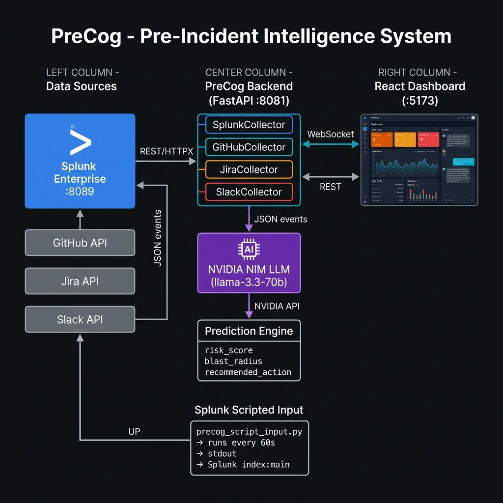

# 🧠 PreCog — Pre-Incident Intelligence for Splunk

> *"Traditional monitoring tells you your house is on fire. PreCog smells the smoke 15 minutes before."*

**PreCog** is an AI-powered pre-incident intelligence dashboard that monitors live Splunk logs across microservices and **predicts system failures before they happen** — not after.

[](LICENSE)
[](https://python.org)
[](https://react.dev)

---

## 🎥 Demo Video

> **[Watch 3-minute demo on YouTube](#)** ← *(replace with your link)*

---

## 🚀 What PreCog Does

| Traditional Monitoring | PreCog |
|---|---|
| Alerts **after** crash | **Predicts before crash** |
| Single data source | Cross-signal correlation (Splunk + GitHub + Jira + Slack) |
| "Something is wrong" | "payments-api fails in 8 min — here's why" |
| Static dashboard | Live risk scores rising in real time |

**Key Features:**
- 🔴 **Real-time risk scoring** — 0-100 per service, updated every 30s from live Splunk data
- 🧠 **AI correlation** — NVIDIA NIM LLM correlates weak signals across data sources
- 💥 **Blast radius** — which downstream services will cascade-fail
- 💰 **Cost of inaction** — live dollar estimate updated as risk rises
- 🤖 **AI Assistant** — context-aware chatbot answers questions about live signals
- 📡 **Splunk Scripted Input** — native Splunk ingestion, no HEC token needed

---

## 🏗️ Architecture



### Data Flow
```
[Your Services / Logs]
        ↓
precog_script_input.py   ← runs inside Splunk every 60s (Scripted Input)
        ↓
Splunk Index (main)      ← stores all telemetry events
        ↓
PreCog Backend (FastAPI :8081)
  ├── SplunkCollector    → queries anomalies via Splunk REST API
  ├── GitHubCollector    → recent risky commits (optional)
  ├── JiraCollector      → open bugs & severity (optional)
  └── SlackCollector     → deployment messages (optional)
        ↓
NVIDIA NIM LLM (llama-3.3-70b-instruct)
  → Correlates all signals → outputs risk_score, blast_radius, recommended_action
        ↓
WebSocket → React Dashboard (:5173)
  → Live risk cards, sparklines, cost panel, AI chat
```

---

## ⚡ Quick Start

### Prerequisites
- [Splunk Enterprise](https://www.splunk.com/en_us/download/splunk-enterprise.html) installed and running locally (default port 8089)
- Python 3.10+
- Node.js 18+

---

### Step 1 — Get your FREE NVIDIA NIM API Key

1. Go to **[build.nvidia.com](https://build.nvidia.com)**
2. Click **Sign In** → create a free account (Google/GitHub login works)
3. Once logged in, click your profile icon (top-right) → **API Keys**
4. Click **Generate API Key** → copy the key (it starts with `nvapi-`)

> ✅ No credit card required. Free tier = 40 requests/minute — enough for full demo.

---

### Step 2 — Get your Splunk API Token

1. Open **Splunk Web** at `http://localhost:8000`
2. Top menu → **Settings → Tokens**
3. Click **New Token**
4. Fill in:
   - **User**: `admin` (or your Splunk username)
   - **Audience**: `precog`
   - **Expiration**: `30d`
5. Click **Create** → **copy the token value immediately** (shown only once)

---

### Step 3 — Clone & Configure

```bash
git clone https://github.com/D0-6/precog.git
cd precog

# Install Python dependencies
pip install -r requirements.txt

# Set up credentials file
cd backend
copy ..\env.example .env
```

Edit `backend/.env` and fill in your keys:

```env
# From Step 1 — build.nvidia.com
NVIDIA_API_KEY=nvapi-xxxxxxxxxxxxxxxxxxxx

# From Step 2 — Splunk Web > Settings > Tokens
SPLUNK_MCP_URL=https://localhost:8089
SPLUNK_TOKEN=your-splunk-token-here
```

---

### Step 4 — Deploy Splunk Scripted Input

This is how PreCog feeds **live telemetry into Splunk**. The script runs inside Splunk every 60 seconds and writes structured JSON events to your index automatically.

#### 4a — Copy the script into Splunk's bin directory

```bash
# Windows — if Splunk is at C:\Program Files\Splunk
copy tools\precog_script_input.py "C:\Program Files\Splunk\etc\apps\search\bin\"

# Windows — if Splunk is at D:\Splunk
copy tools\precog_script_input.py "D:\Splunk\etc\apps\search\bin\"

# Linux / Mac
cp tools/precog_script_input.py $SPLUNK_HOME/etc/apps/search/bin/
```

#### 4b — Create the Scripted Input in Splunk Web

1. Open Splunk Web → **Settings** (top menu) → **Data Inputs**
2. Click **Scripts** from the list
3. Click **New** (top right)
4. In the **Script** field, enter the full path:
   ```
   # Windows example:
   C:\Program Files\Splunk\etc\apps\search\bin\precog_script_input.py

   # Linux/Mac example:
   $SPLUNK_HOME/etc/apps/search/bin/precog_script_input.py
   ```
5. Set **Interval**: `60`
6. Set **Source type**: `_json`
7. Set **Index**: `main`
8. Click **Next** → **Review** → **Submit**

#### 4c — Verify data is flowing

In **Splunk Search**, run:
```spl
index=main source="precog_script_input.py" | head 10
```

You should see JSON events like:
```json
{"service": "payments-api", "level": "WARN", "cpu_usage": 78.3, "memory_usage": 65.1, "error_rate": 2.4, "latency_ms": 890}
```

---

### Step 5 — Start the Backend

```bash
cd backend
python -m uvicorn main:app --host 127.0.0.1 --port 8081 --reload
```

Expected output:
```
INFO: Application startup complete.
INFO: [PreCog] Discovered 5 services from Splunk
INFO: [PreCog] Refreshing predictions in background...
```

---

### Step 6 — Start the Frontend

Open a new terminal:
```bash
cd frontend
npm install
npm run dev
```

Open **http://localhost:5173** — your Splunk services appear automatically with live AI risk scores.

---

### Step 7 — Connect Splunk in the Dashboard

Click the ⚙️ **Settings** gear icon in the top-right of the dashboard:
- **Splunk URL**: `https://localhost:8089`
- **Index**: `main`
- **Token**: your Splunk API token (from Step 2)

Click **Save & Reconnect**.

---

## 🎯 Running the Live Demo (Crash Scenario)

Once running, trigger a crash scenario to demonstrate PreCog predicting failure **before** it happens:

```bash
# Step 1 — Everything is healthy
echo normal > C:\Temp\precog_phase.txt

# Step 2 — Introduce warning signals (watch risk scores climb to 40-60)
echo warn > C:\Temp\precog_phase.txt

# Step 3 — Critical signals fire (risk spikes to 80-100)
echo crash > C:\Temp\precog_phase.txt

# Step 4 — Reset
echo normal > C:\Temp\precog_phase.txt
```

> 💡 Each phase takes effect within 60 seconds (next script run).
> Watch risk scores rise in real time — **before** any actual crash occurs.

---

## 🔧 Configuration Reference

### `backend/.env`
```env
# NVIDIA NIM — get free key at build.nvidia.com
NVIDIA_API_KEY=nvapi-xxxx

# Splunk — get token at Settings > Tokens in Splunk Web
SPLUNK_MCP_URL=https://localhost:8089
SPLUNK_TOKEN=your-splunk-token

# Optional integrations (leave blank to skip)
GITHUB_TOKEN=ghp_xxxx
GITHUB_ORG=your-org
JIRA_URL=https://yourorg.atlassian.net
JIRA_EMAIL=you@email.com
JIRA_TOKEN=your-jira-token
SLACK_TOKEN=xoxb-xxxx
SLACK_CHANNEL_IDS=C01234567
```

---

## 📁 Project Structure

```
precog/
├── backend/
│   ├── main.py                    # FastAPI app — all API + WebSocket endpoints
│   ├── config.py                  # API keys, NVIDIA model chain
│   ├── collectors/
│   │   ├── splunk_collector.py    # Live Splunk REST API integration
│   │   ├── github_collector.py    # GitHub commit signals
│   │   ├── jira_collector.py      # Jira bug signals
│   │   └── slack_collector.py     # Slack deployment signals
│   ├── engine/
│   │   ├── correlator.py          # NVIDIA NIM AI signal correlation
│   │   ├── extras.py              # DB logging, sparklines
│   │   └── features.py            # Cost estimation, benchmarks
│   ├── models/
│   │   └── schemas.py             # Pydantic data models
│   └── demo/
│       └── synthetic_data.py      # Demo scenario data
├── frontend/
│   └── src/
│       └── App.jsx                # Full React dashboard
├── tools/
│   ├── precog_script_input.py     # ← Deploy this to Splunk bin/
│   └── generate_crash_scenario.py # Crash scenario generator
├── architecture_diagram.png
├── .env.example                   # Copy to backend/.env
├── requirements.txt
└── README.md
```

---

## 📦 Dependencies

```bash
pip install -r requirements.txt
```

**Python:** `fastapi`, `uvicorn`, `openai`, `httpx`, `splunk-sdk`, `pydantic`, `python-dotenv`
**Node:** `react`, `recharts`, `vite`, `@vitejs/plugin-react`
**AI:** [NVIDIA NIM](https://build.nvidia.com) — `meta/llama-3.3-70b-instruct` (free tier)
**Data:** [Splunk Enterprise](https://splunk.com) (free trial available)

---

## 🤖 How AI Works in PreCog

1. **Every 30s** — SplunkCollector queries live logs for anomalies, error spikes, latency
2. **Multi-source signals** — GitHub commits, Jira bugs, Slack deploys collected in parallel
3. **NVIDIA NIM LLM** — all signals sent to `llama-3.3-70b-instruct` for correlation
4. **Structured output** — JSON with `risk_score`, `risk_level`, `explanation`, `blast_radius`, `recommended_action`
5. **Fallback chain** — 5 models tried in sequence if one is rate-limited
6. **WebSocket push** — frontend gets live updates instantly

---

## 📄 License

MIT — see [LICENSE](LICENSE)

---

*Built for the Splunk AI Hackathon 2025*
